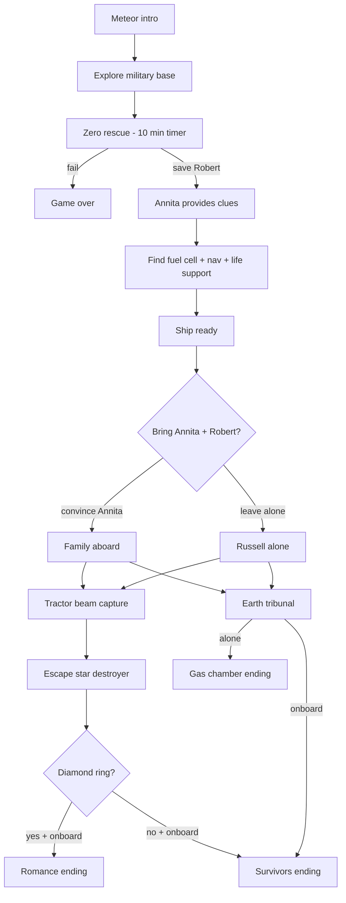

# Chaos in Kalanthia — Design Document

A Blade Runner universe point-and-click adventure built with **Adventure Game Studio (AGS)**, playable in **ScummVM**.

## Vision

| Field | Detail |
|-------|--------|
| **Universe** | Blade Runner (off-world colonies, replicants, dystopian future) |
| **Setting** | Kalanthia — remote colony planet, devastated by meteor strike |
| **Genre** | Point-and-click adventure, Sierra-style interface |
| **Tone** | Tense survival, noir undertones, moments of humanity |
| **Engine** | AGS 3.6 Sierra-style template, 320×200 |
| **Structure** | 3 acts, branching ending |

## Premise

A massive **meteor strike** has devastated the off-world colony planet **Kalanthia**. The military base lies in ruins. **Russell**, a replicant soldier, awakens among the wreckage. His only escape is a damaged spaceship — but it needs vital components before it can fly.

In the nearest town, the megacomplex **Apartment Building Zero** ("Zero") is collapsing. Russell must rescue **Robert**, the stranded son of **Annita**, a native Kalanthian woman — within **10 minutes**, or it's game over.

After saving Robert, Annita helps Russell locate the missing ship components. When the ship is ready, Russell faces a critical choice: bring Annita and Robert to Earth, or leave Kalanthia alone.

During the hyperspace journey, a **star destroyer-style warship** traps Russell's ship with a tractor beam. Russell must escape a jail cell, disable the tractor beam (by pouring **hot coffee** into a computer), and recover his ship from the hangar bay. A hidden **diamond ring** can change the final ending.

Back on Earth, Russell's superiors accuse him of terrorism — they refuse to believe the meteor story because there are **no other survivors**. The ending depends on whether Annita and Robert came aboard.

---

## Characters

### Russell (protagonist)
- **Type:** Replicant soldier
- **Role:** Player character
- **Arc:** Lone survivor → reluctant hero → judged saviour or condemned terrorist
- **Voice:** Stoic, practical, dry humour under pressure

### Annita
- **Type:** Native Kalanthian woman
- **Role:** Ally (after rescue sequence)
- **Motivation:** Protect her son; torn between her homeworld and survival
- **Key beat:** Must be **convinced** to leave Kalanthia if player chooses the "bring to Earth" ending

### Robert
- **Type:** Annita's young son
- **Role:** Rescue objective (Act 1), witness (Act 3)
- **Location:** Top floor of Zero megacomplex

---

## Three Acts

### Act 1 — Kalanthia (Survival)

**Intro sequence:** Meteor strike devastation. Russell awakens at the destroyed military base.

**Goal:** Rescue Robert → gain Annita's help → find ship components → escape Kalanthia.

#### Sequence A: Zero Rescue (timed — 10 minutes)

| Element | Detail |
|---------|--------|
| Location | Apartment Building Zero, nearest town |
| Timer | 600 seconds (10 min); failure = game over |
| Objective | Reach top floor, save Robert, escape before collapse |
| Puzzles (TBD) | Navigate collapsing floors, clear rubble, restore emergency power, find route to Robert |

#### Sequence B: Military Base (exploration)

| Component | Where to find (TBD) | Puzzle idea |
|-----------|---------------------|-------------|
| **Fuel cell** | Reactor bay / supply depot | Bypass damaged security, reroute power |
| **Nav module** | Command centre wreckage | Reassemble from salvaged parts |
| **Life support unit** | Medical bay / hangar stores | Trade or repair with found items |

Annita provides **clues** after Robert is rescued (dialogue-driven progression).

#### Sequence C: Departure Choice

When the ship is ready, Russell chooses:

| Choice | Requirement | Consequence |
|--------|-------------|-------------|
| **Bring Annita + Robert** | Convince Annita (dialogue puzzle — she is a native) | Good ending path available |
| **Leave alone** | None | Bad ending path locked in |

---

### Act 2 — Star Destroyer (Imprisonment)

Russell's ship is caught in a **tractor beam** and pulled into a massive warship.

- If Annita and Robert are aboard, they **hide in the ship** during this act
- Russell is **sent to a jail cell**

#### Escape sequence

| Step | Location | Puzzle |
|------|----------|--------|
| 1 | Jail cell | Hot-wire panel next to air duct (needs **wire**) |
| 2 | Ventilation system | Navigate ducts to reach key areas |
| 3 | Galley / mess | Obtain **hot coffee** (must be hot — cold won't work) |
| 4 | Control room | Pour hot coffee into tractor beam terminal → disable beam |
| 5 | Optional | Find **diamond ring** (hidden collectible on star destroyer) |
| 6 | Hangar bay | Return to ship, escape |

---

### Act 3 — Earth (Judgement)

Russell travels to Earth at hyperspeed. His superiors demand an explanation.

**The accusation:** Command believes Russell caused the Kalanthia destruction — a terrorist act, not a meteor. Evidence: **zero survivors** (human or replicant) except Russell.

#### Endings

| Ending | Conditions | Outcome |
|--------|------------|---------|
| **Bad — Gas chamber** | Annita and Robert NOT brought to Earth | Russell executed; no witnesses |
| **Good — Survivors** | Annita + Robert aboard; no ring | Annita and Robert emerge with proof (debris analysis, records); meteor confirmed |
| **Good — Romance** | Annita + Robert aboard + diamond ring gifted | Same as above, plus Russell and Annita embrace in final scene |

---

## Room Map

| Room # | Script | Act | Location | Status |
|--------|--------|-----|----------|--------|
| 1 | room1 | 1 | Intro / title (meteor aftermath) | Placeholder |
| 2 | room2 | 1 | Military base — exterior | TODO |
| 3 | room3 | 1 | Military base — interior | TODO |
| 10 | room10 | 1 | Zero — ground floor | TODO |
| 12 | room12 | 1 | Zero — upper floors (Robert) | Script stub + timer |
| 20 | room20 | 1 | Reactor bay (fuel cell) | TODO |
| 21 | room21 | 1 | Command centre (nav module) | TODO |
| 22 | room22 | 1 | Medical bay (life support) | TODO |
| 30 | room30 | 1 | Spaceship hangar | Script stub |
| 40 | room40 | 2 | Star destroyer — jail cell | Script stub |
| 41 | room41 | 2 | Ventilation ducts | TODO |
| 43 | room43 | 2 | Tractor beam control room | Script stub |
| 44 | room44 | 2 | Galley (hot coffee) | TODO |
| 45 | room45 | 2 | Hangar bay | TODO |
| 50 | room50 | 3 | Earth tribunal | Script stub |
| 51 | room51 | 3 | Gas chamber (bad ending) | Script stub |

---

## Inventory Items

| ID | Item | Act | Purpose |
|----|------|-----|---------|
| 1 | Fuel cell | 1 | Ship component |
| 2 | Nav module | 1 | Ship component |
| 3 | Life support unit | 1 | Ship component |
| 4 | Hot coffee | 2 | Disable tractor beam terminal |
| 5 | Diamond ring | 2 | Optional — romance ending |
| 6 | Wire | 2 | Hot-wire jail cell panel |

---

## Puzzle Dependency Graph

---

## Global State (implemented in `GameLogic.asc`)

| Variable / Flag | Purpose |
|-----------------|---------|
| `gCurrentAct` | 1 = Kalanthia, 2 = Star Destroyer, 3 = Earth |
| `gRobertRescued` | Zero sequence complete |
| `gAnnitaOnboard` | Player convinced Annita to leave |
| `gRobertOnboard` | Robert aboard ship |
| `gRingGifted` | Diamond ring given to Annita |
| `gShipComponentsFound` | Count of components collected (need 3) |
| `TIMER_ZERO_COLLAPSE` | 600-second countdown in room 12 |

---

## Audio / Visual Direction

- **Visual:** Blade Runner aesthetic — rain-slicked surfaces, neon accents, industrial decay, smoke and ash from meteor impact
- **Zero megacomplex:** Brutalist architecture, flickering emergency lights, groaning metal
- **Star destroyer:** Cold military interiors, harsh lighting, oppressive scale
- **Earth tribunal:** Sterile government chamber, noir shadows
- **Music:** Synth-heavy, Vangelis-inspired ambient; tension builds during Zero timer

---

## Legal Note

This is a **fan project** set in the Blade Runner universe. It is not affiliated with or endorsed by Alcon Entertainment, Ridley Scott, or Philip K. Dick's estate. Consider original naming if pursuing commercial release.